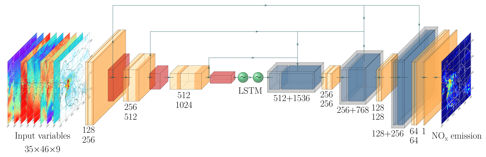

## Application of the U-net model for Chinese NOx emission estimates. 
This repo is prepared for the submission of the ACP paper.

## 1. System prerequisites
The following software dependencies are required.

Package     | Version
---------   | -----------
Python      | 3.6.3
TensorFlow  | 2.1.0
CUDA        | 8.0.44
cuDNN       | 7.0
TensorFlow  | 2.1.0
Keras       | 2.3.1

A detailed list of packages installed while while testing and validating the model is provided in `Unet_package_list.txt`.

### 2. Source of data
* Training stage 1 involves TCR-2 surface NO2 concentrations and NOx emissions. Both could be found from [the JPL TCR-2 website](https://tes.jpl.nasa.gov/tes/chemical-reanalysis/products/monthly-mean). Last access to the link was 4 October 2022. 
* Training stage 2 involves *in situ* measurements from the China Ministry of Ecology and Environment (MEE) observation network ([MEE website](http://106.37.208.233:20035), last access: 18 February 2022). 
* Both stages require meteorological fields from ERA5 on [single levels](https://cds.climate.copernicus.eu/cdsapp#!/dataset/reanalysis-era5-single-levels?tab=overview) and on [pressure levels](https://cds.climate.copernicus.eu/cdsapp#!/dataset/reanalysis-era5-pressure-levels?tab=overview).

### 3. Code usage
Examples of usage of the code are provided in the notebook `example_code.ipynb`.

### Reference
He, T.-L.; Jones, D. B. A.; Miyazaki, K; Bowman, K. W.; Jiang, Z.; Chen, X; Li, R.; Zhang, Y; Li, K. [Inverse modeling of Chinese NOx emissions using deep learning: Integrating in situ observations with a satellite-based chemical reanalysis](https://acp.copernicus.org/preprints/acp-2022-251/). *Atmospheric Chemistry and Physics*, 2022.
